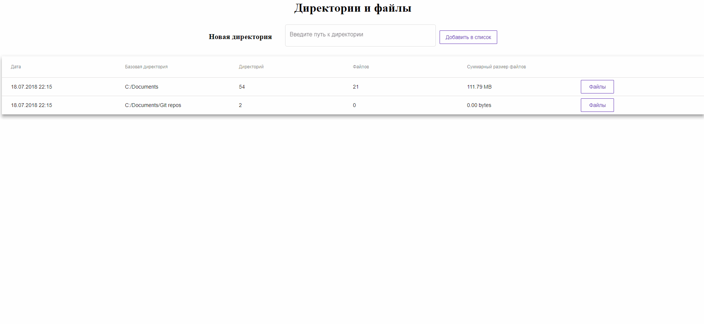

# Веб-приложение "Директории и файлы"



Приложение хранит список сохранённых директорий локальной файловой системы, а также информацию о вложенных папках и файлах.

В качестве технологий для разработки были выбраны следующие решения:
- **Angular** в качестве клиетской части
- **Spring Boot** в качестве серверной части (REST API)
- **H2** в качестве базы данных

> Для запуска приложения на компьютере должен быть установлен JDK или JRE

Запуск происходит посредством запуска команды:
```sh
java -jar directories-app-bundle-0.0.1-SNAPSHOT.jar
```

После этого можно использовать приложение, перейдя по адресу http://localhost:8080

Данные, созданные в процессе использования, хранятся в файле базы данных **directoriesdb.mv.db**, который создаётся при первом запуске jar-файла в той же директории.

Для проверки хранимых данных в базе данных есть возможность перейти по адресу http://localhost:8080/h2_console
